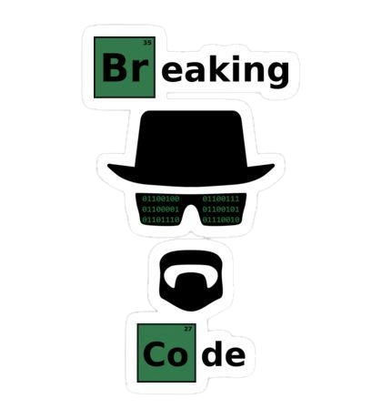

</img>

 

<table width="100%">
<tr>
<td width="55%" valign="top">

<picture>
  <source media="(prefers-color-scheme: dark)" srcset="images/Shub-script-Skill-Dark.gif">
  <source media="(prefers-color-scheme: light)" srcset="images/Shub-script-Skill-White.gif">
  
</picture>

</td>

<td width="45%" align="center" valign="top">

</td>
</tr>
</table>

</td>

</tr>
</table>

**Code Cycle** 

&nbsp;&nbsp;&nbsp;&nbsp;&nbsp;

&nbsp;&nbsp;&nbsp;&nbsp;&nbsp;
 

<table align="center">

<tr>
<td align="center" width="120" height="120">
  
HTML
</td>

<td align="center" width="120" height="120">
  
CSS
</td>

<td align="center" width="120" height="120">
  
JavaScript
</td>

<td align="center" width="120" height="120">
  
TypeScript
</td>

<td align="center" width="120" height="120">
  
Python
</td>

<td align="center" width="120" height="120">
  
PHP
</td>

<td align="center" width="120" height="120">
  
Java
</td>

<td align="center" width="120" height="120">
  
C++
</td>

<td align="center" width="120" height="120">
  
Go
</td>

<td align="center" width="120" height="120">
  
Ruby
</td>
</tr>

<tr>
<td align="center" width="120" height="120">
  
GitHub
</td>

<td align="center" width="120" height="120">
  
GitHub Actions
</td>

<td align="center" width="120" height="120">
  
Postman
</td>

<td align="center" width="120" height="120">
  
Ngrok
</td>

<td align="center" width="120" height="120">
  
Linux
</td>

<td align="center" width="120" height="120">
  
Windows
</td>

<td align="center" width="120" height="120">
  
WordPress
</td>

<td align="center" width="120" height="120">
  
Bash
</td>

<td align="center" width="120" height="120">
  
Scripting
</td>

<td align="center" width="120" height="120">
  
SEO
</td>
</tr>

<tr>
<td align="center" width="120" height="120">
  
MongoDB
</td>

<td align="center" width="120" height="120">
  
MySQL
</td>

<td align="center" width="120" height="120">
  
Firebase
</td>

<td align="center" width="120" height="120">
  
AWS
</td>

<td align="center" width="120" height="120">
  
GraphQL
</td>

<td align="center" width="120" height="120">
  
React
</td>

<td align="center" width="120" height="120">
  
Flask
</td>

<td align="center" width="120" height="120">
  
Tailwind CSS
</td>

<td align="center" width="120" height="120">
  
Bootstrap
</td>

<td align="center" width="120" height="120">
  
StoryBook
</td>
</tr>

<tr>
<td align="center" width="120" height="120">
  
Backlinks
</td>

<td align="center" width="120" height="120">
  
ChatGPT
</td>

<td align="center" width="120" height="120">
  
Black Hat SEO
</td>

<td align="center" width="120" height="120">
  
Ollama
</td>
</tr>

</table>

<!-- ===================== CYBER ARSENAL ===================== -->

<table width="100%">
<tr>

<table width="100%">
<tr>

<!-- LEFT SIDE IMAGE -->

<td width="45%" align="center" valign="middle">

</td>

<!-- RIGHT SIDE PROJECTS -->

<td width="55%" valign="top">

<h2>⚡ Projects</h2>

</td>

</tr>
</table>

<!-- ===================== DASHBOARD ===================== -->

<h2 align="center">✨ Dashboard</h2>

 

<!-- SNAKE -->

 

<!-- STREAK -->

 

<!-- SUMMARY TABLE -->

<table width="100%" align="center">

<tr>

<td align="center" width="50%">

</td>

<td align="center" width="50%">

</td>

</tr>

<tr>

<td align="center" width="50%">

</td>

<td align="center" width="50%">

</td>

</tr>

</table>

 

<!-- PROFILE DETAILS -->

 

<h2 align="center"> 👋 Connect With Me </h2>

<table align="center">
<tr>

<td align="center">

</td>

<td align="center">

</td>

<td align="center">

</td>

<td align="center">

</td>

</tr>
</table>

